`import random as R`


|               函数名                |                描述                 |
| :--------------------------------: | :--------------------------------: |
|             R.random()             |     返回一个[0, 1) 之间的随机实数     |
|           R.uniform(a,b)           |      返回[a,b] 区间内的随机实数       |
|         R.randint(a, b)	         |   返回在[a, b]范围内的整数(包含a,b)  |
| R.randrange([start,] stop[, step]) | 返回range(start,stop,step)中的随机数 |
|          R.choice(seq)	          |         从序列中返回随意元素          |
|      R.shuffle(seq[, random])      |     随机指定序列的顺序(乱序序列）      |
|         R.sample(seq,n)	         |   从序列中选择n个随机且不重复的元素    |
|                                    |                                    |


#### 获取人员列表接口

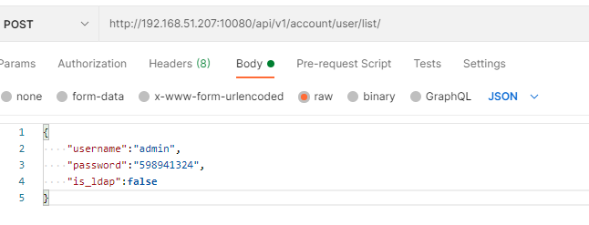

#### 创建业务线

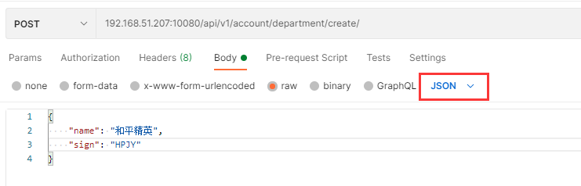

#### 获取部门列表

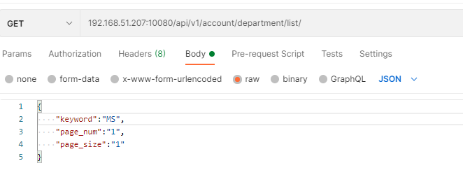

#### 删除部门属性

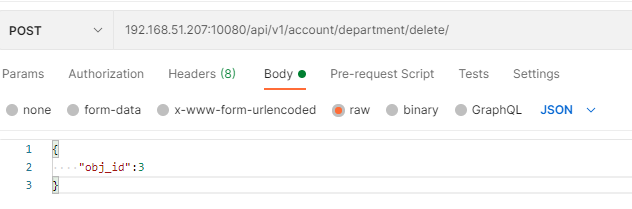

#### 编辑部门属性

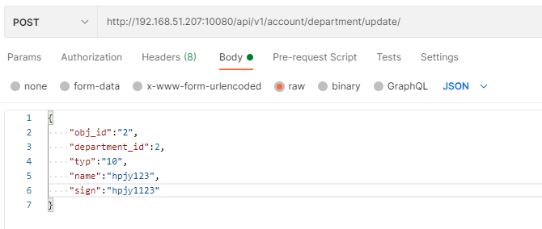

#### 部门关联用户

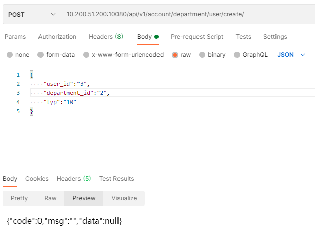

#### 删除部门用户

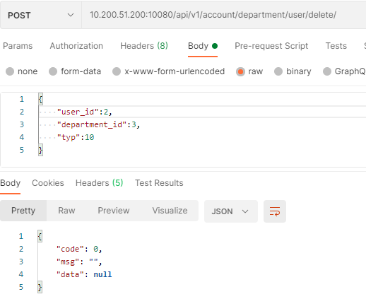

#### 获取部门用户列表

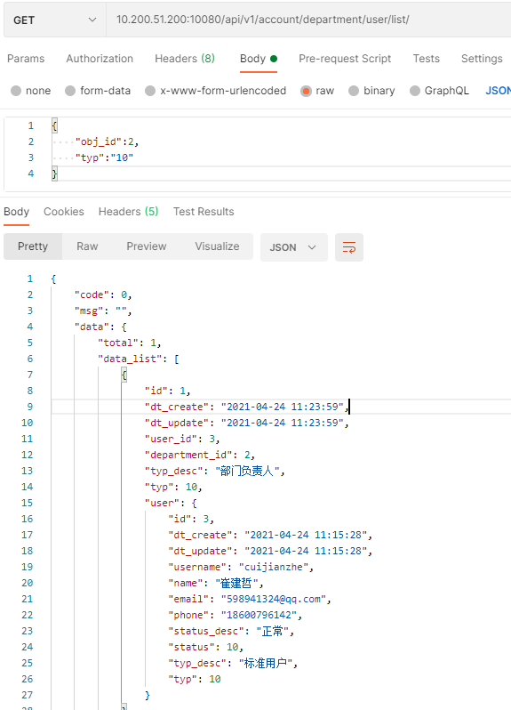

#### 创建role

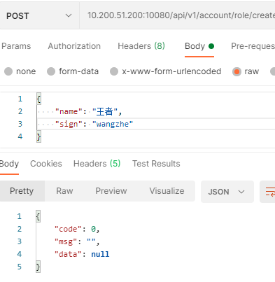

#### 删除role

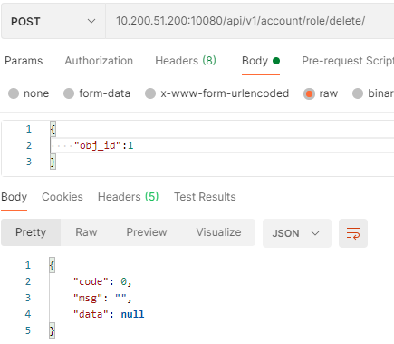

#### 更新role


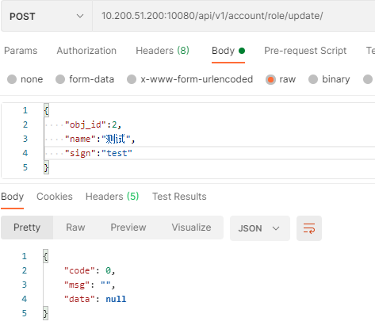

#### 获取role列表

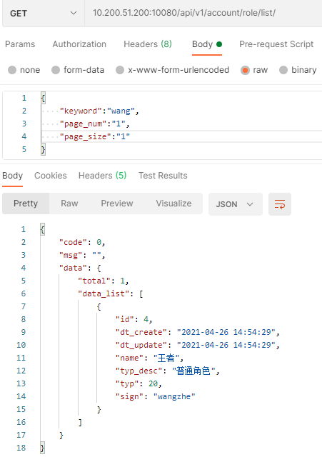

#### 获取用户关联角色列表

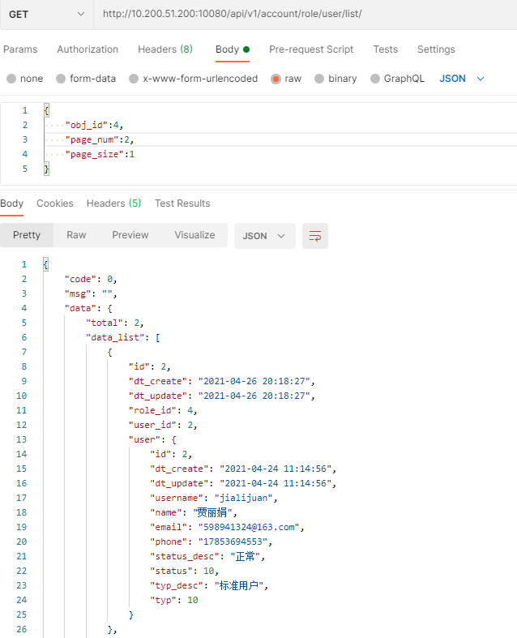

#### 更新权限信息

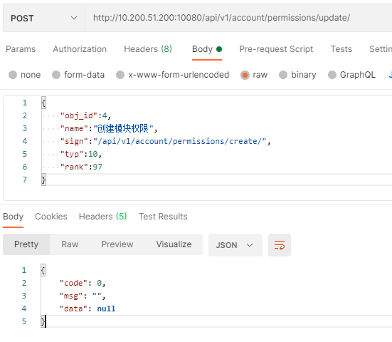

#### 获取权限列表

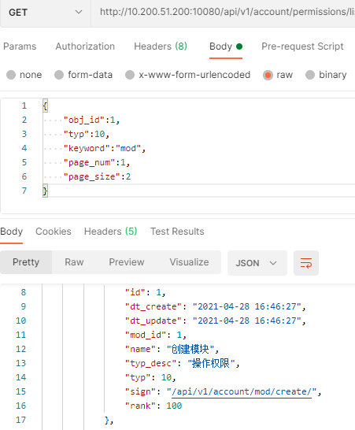

#### 获取模块列表

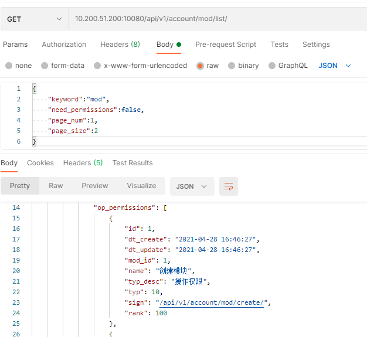

#### 设置角色模块关联

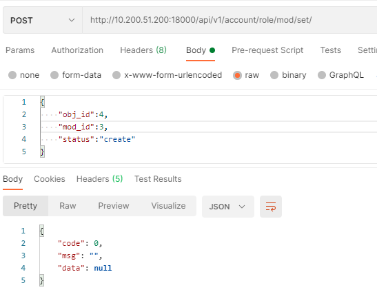

#### 获取用户角色列表

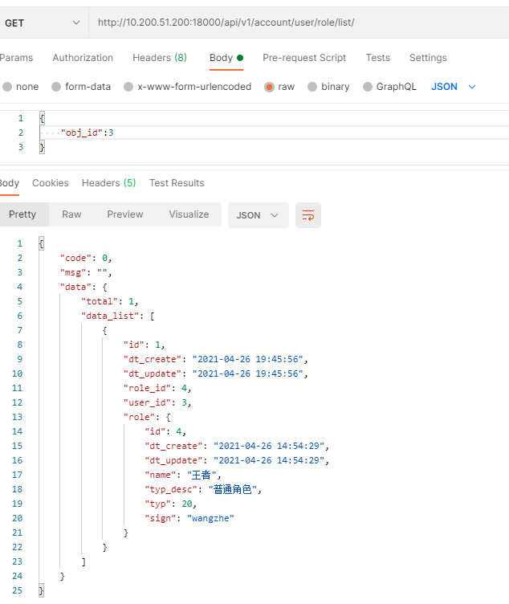


#### 创建阿里云key

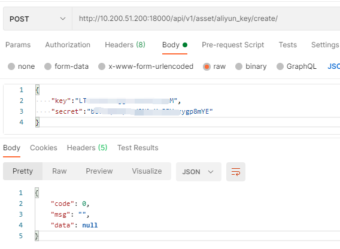

#### 获取gitlab服务列表

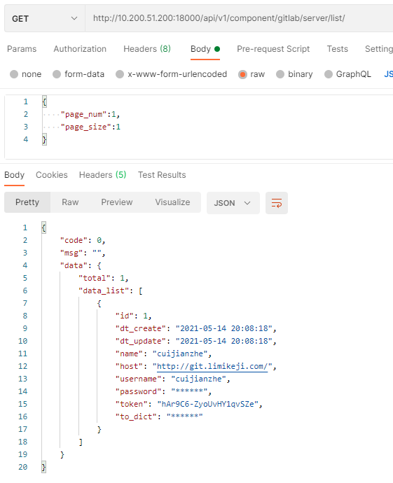

#### 创建资产模块

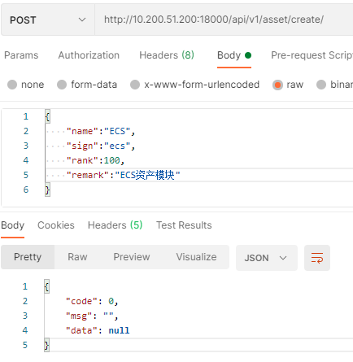

#### 创建任务类型


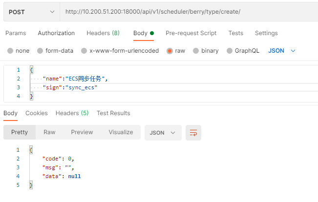


#### 获取slb实例信息

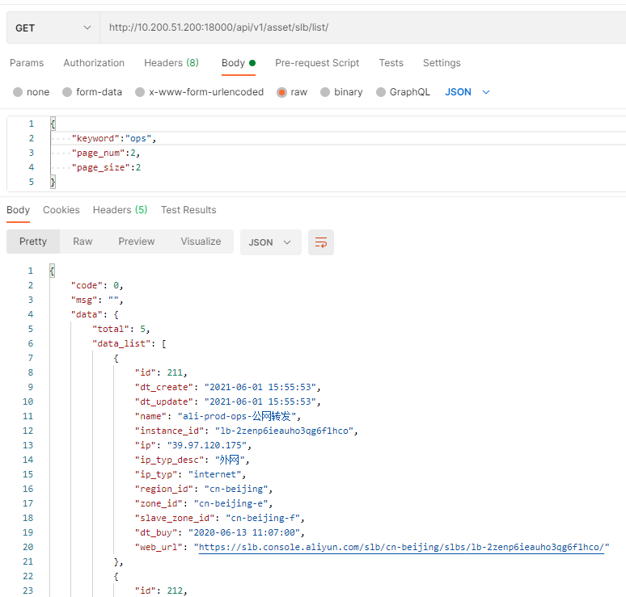

#### 获取域名解析列表

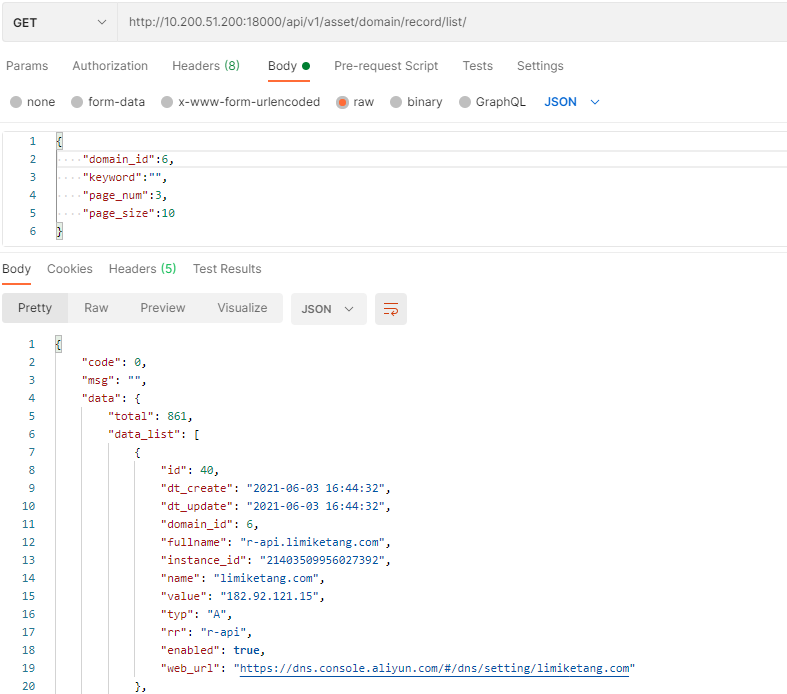

#### 获取gitlab项目

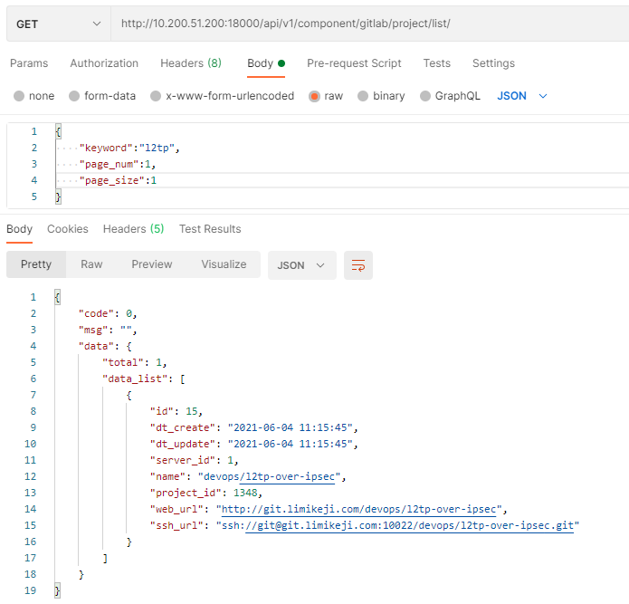


#### 同步任务怪谈

因为异步任务暂时没搞定，就用接口去同步

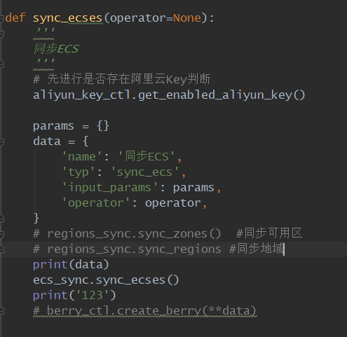


### 任务

任务开启：

`celery  -A cow worker -l info -n worker-hd1 -Q high_priority,default`

> 定时任务是通过celery的beat来完成的，这里写了一个示例，每10秒执行一次account.tasks.timer_hello_task.  

------
> account/tasks.py:  
> 这里就写了两个demo任务，可以通过以下步骤来尝试.  
> * 首先确保安装了rabbitmq，并且正确的配置了celery.  
> * 执行```celery  -A rurality worker -l info -n worker-hd1 -Q high_priority,default```  
> * 执行```celery -A rurality beat -l info```  
> * 进入```python manage.py shell```  
* 执行```from account.tasks import hello_task```
* 执行```hello_task.delay()```  

> 以上就可以看到任务执行了，并且也可以看到定时那个任务一直在执行.  
