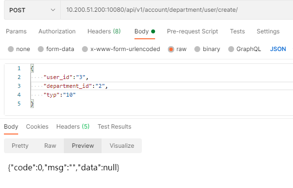

`import random as R`

|               函数名                |                描述                 |
| :--------------------------------: | :--------------------------------: |
|             R.random()             |     返回一个[0, 1) 之间的随机实数     |
|           R.uniform(a,b)           |      返回[a,b] 区间内的随机实数       |
|         R.randint(a, b)	         |   返回在[a, b]范围内的整数(包含a,b)  |
| R.randrange([start,] stop[, step]) | 返回range(start,stop,step)中的随机数 |
|          R.choice(seq)	          |         从序列中返回随意元素          |
|      R.shuffle(seq[, random])      |     随机指定序列的顺序(乱序序列）      |
|         R.sample(seq,n)	         |   从序列中选择n个随机且不重复的元素    |
|                                    |                                    |

#### 获取人员列表接口

#### 创建业务线

#### 获取部门列表

#### 删除部门属性

#### 编辑部门属性

#### 部门关联用户

#### 删除部门用户

#### 获取部门用户列表

#### 创建role

#### 删除role

#### 更新role

#### 获取role列表

#### 获取用户关联角色列表

#### 更新权限信息

#### 获取权限列表

#### 获取模块列表

